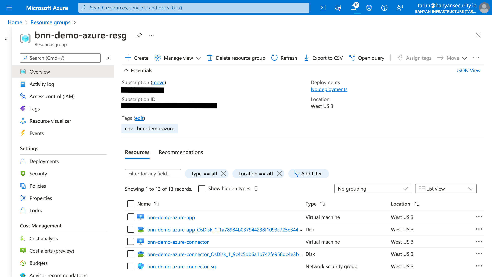
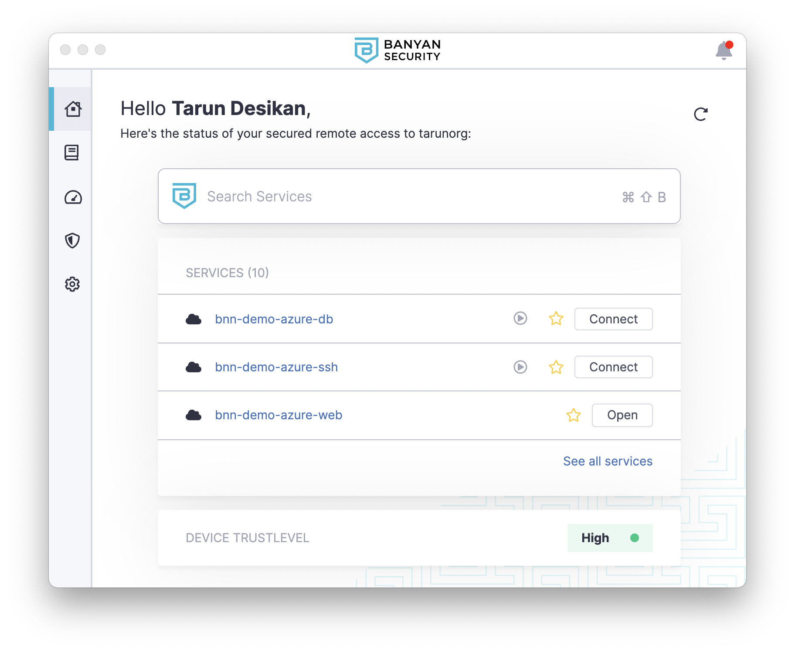
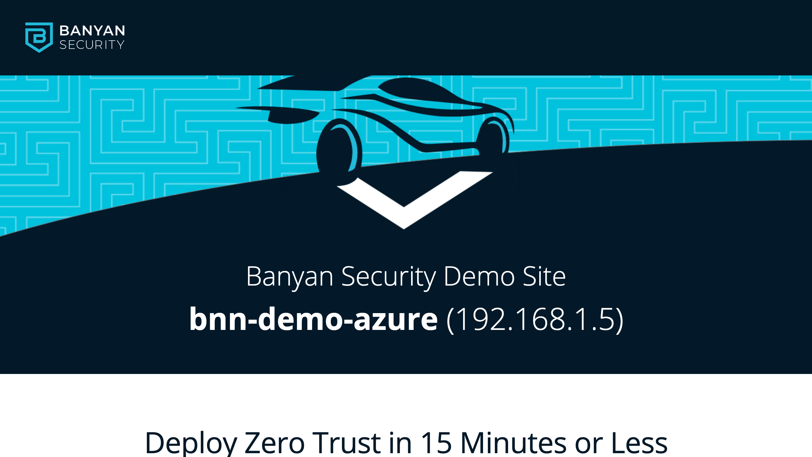
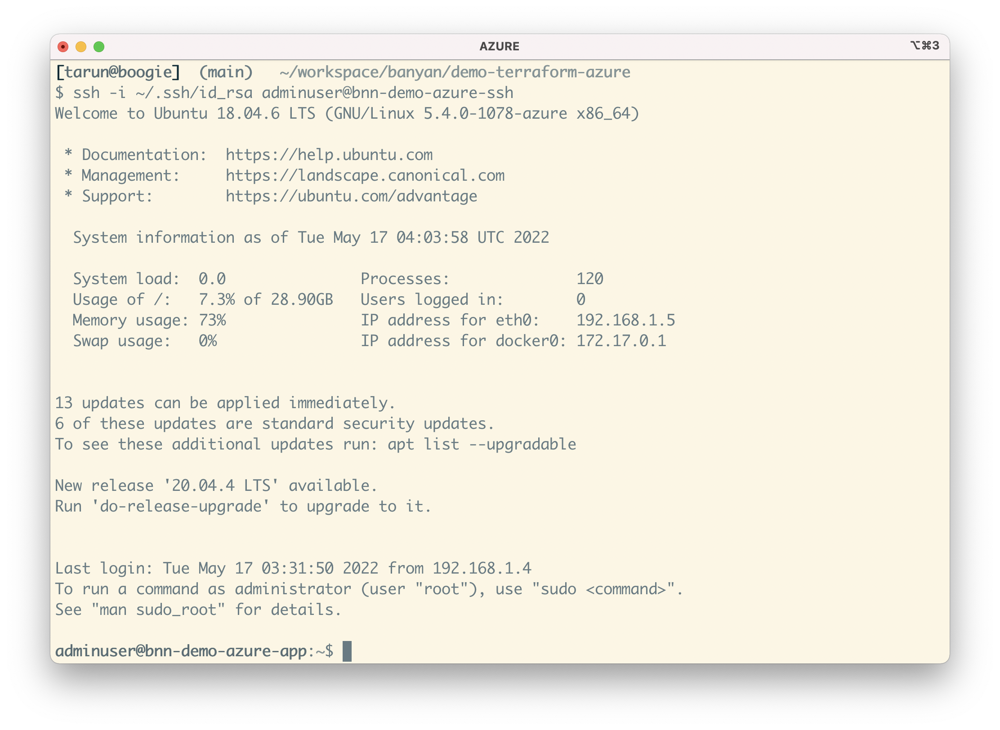
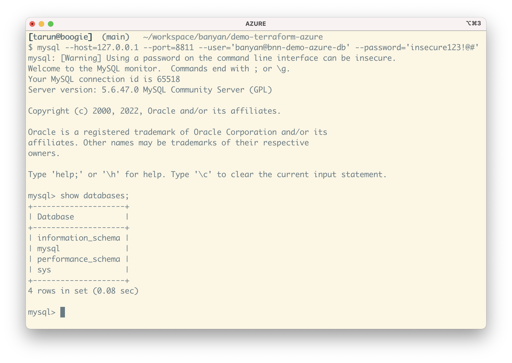

# Banyan Security demo for Azure environments using Terraform


## Prerequisities

To run this demo, you will need the following:

1. Azure account with credentials
2. An SSH key-pair for authentication into Linux VMs we'll create
2. Terraform CLI 0.14.9+, configured for Azure provisioning
3. Banyan account and admin API key, and a device with the Banyan Desktop App installed

For instructions on how to set these up, go to the [Prerequisities Details section](#prerequisities-details).


## Run it

Clone this repo to your machine. Edit the `locals.tf` file with details from your environment.

```tf
locals {
  name_prefix = "bnn-demo-azure"

  region = "westus3"
  ssh_key_path = "~/.ssh/id_rsa.pub"

  banyan_host = "https://team.console.banyanops.com/"
  banyan_api_key = "YOUR_BANYAN_API_KEY"
  banyan_org = "YOUR_BANYAN_ORG"
}
```

Then, provision all the resources:

```bash
terraform apply
```

Provisioning is broken up into 6 steps; the code is written so you can run it step-by-step by specifying each step during the apply as: `terraform apply -target=module.network`

1. **Network** - a new Resource Group with a virtual network and subnet
2. **Database** - an Azure Database for MySQL instance
3. **Application** - an VM instance that runs a demo website container
4. **Banyan Connector** - deploy an VM instance with the `connector` to create an outbound connection to the Banyan Global Edge network, so you can manage access to your Azure environment
5. **Banyan Policies** - create a few roles and policies to establish which users and devices can access your Azure environment
6. **Banyan Services** - publish the services that are deployed in your Azure environment for your end users

This first 3 steps get you a basic but representative Azure environment. The last 3 steps set up Banyan to provide secure remote access to this environment.


## Access your Azure resources

All your deployed Azure resources - VM and Database - are in a private subnet with private IPs. They cannot be directly reached from the public internet.



To access your Azure resources from your device, open the Banyan App and click on a given service to connect to it.



Clicking "Open" on your web application `bnn-demo-azure-web` will launch a new browser tab and take you the demo site after authentication.



To SSH into the Linux server, click "Connect" on the SSH service `bnn-demo-azure-ssh`. Then run the SSH command with your key-pair as the credential: 

```
ssh -i YOUR_KEY_NAME adminuser@bnn-demo-azure-ssh
```



To access your Azure Database instance, click "Connect" on the DB service `bnn-demo-azuredb`. Then, fire up your favorite MySQL client and connect to your database at `127.0.0.1:8811`, using the credentials (`banyan@bnn-demo-azure-db`, `insecure123!@#`) we configured via Terraform:

```
mysql --host=127.0.0.1 --port=8811 --user='banyan@bnn-demo-azure-db' --password='insecure123!@#'
```




Behind the scenes, Banyan uses [short-lived cryptographic credentials](https://docs.banyansecurity.io/docs/intro/concepts/services/) to connect you to your AWS resources and a [zero trust security model](https://docs.banyansecurity.io/docs/intro/concepts/policies/) to enforce access control policies.


# Prerequisities Details

### Azure

This demo requires an Azure account. If you don't already have an Azure account, you can create a [free Azure account](https://azure.microsoft.com/en-us/free/).

Then, install the [Azure CLI](https://docs.microsoft.com/en-us/cli/azure/install-azure-cli) and [sign in to your Azure account](https://docs.microsoft.com/en-us/cli/azure/authenticate-azure-cli).


### Terraform

This demo uses Terraform. Follow the [getting started in Azure tutorial](https://learn.hashicorp.com/tutorials/terraform/install-cli?in=terraform/azure-get-started) to install the Terraform CLI (v0.14.9+), learn the basics of Terraform and configure authentication for Azure.


### Banyan

This demo shows you to how to use Banyan Security Zero Trust Remote Access. If you don't have a Banyan account, sign up for a [free Banyan account](https://www.banyansecurity.io/team-edition-signup/).

Take note of your Org name. Navigate to the API Keys section in the Banyan Command Center console and [create an admin API key](https://docs.banyansecurity.io/docs/banyan-components/command-center/api-keys/). Also, [install the Banyan Desktop App on your device](https://support.banyanops.com/support/solutions/folders/44000931532).


